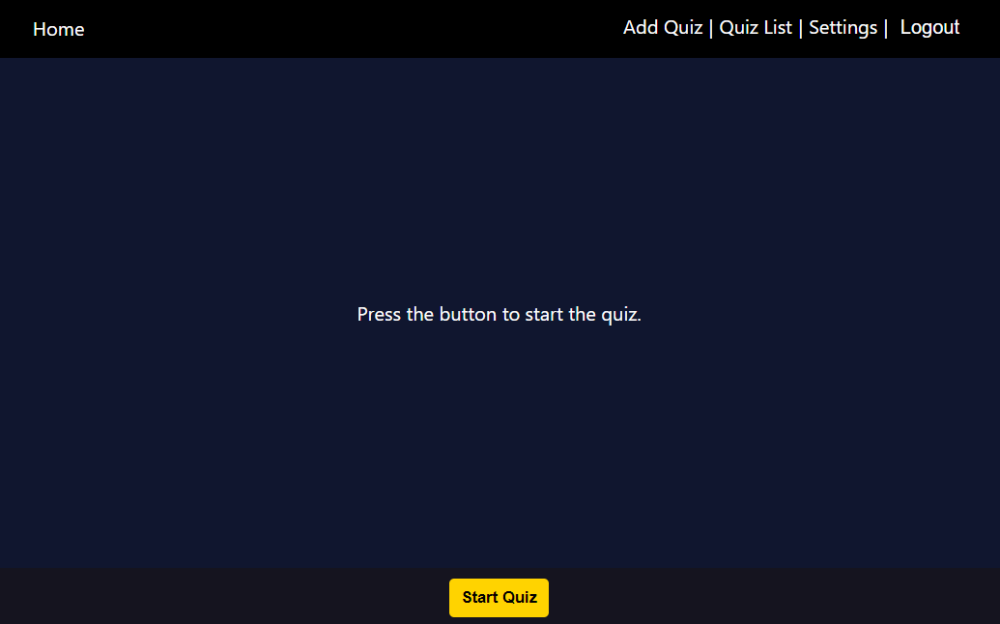
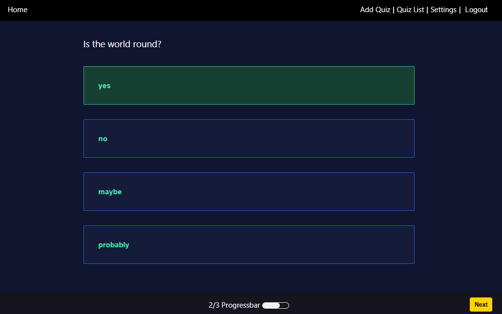
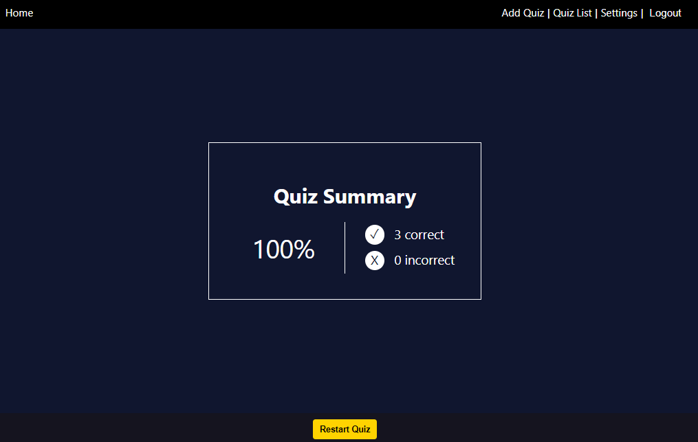
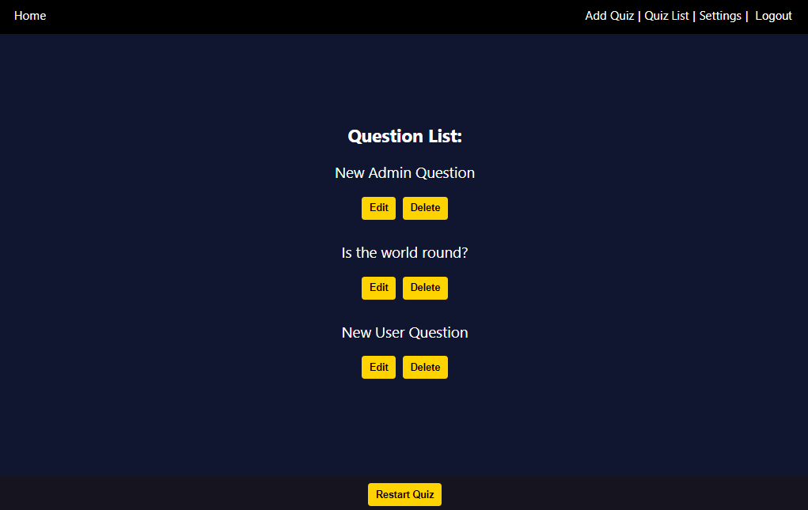
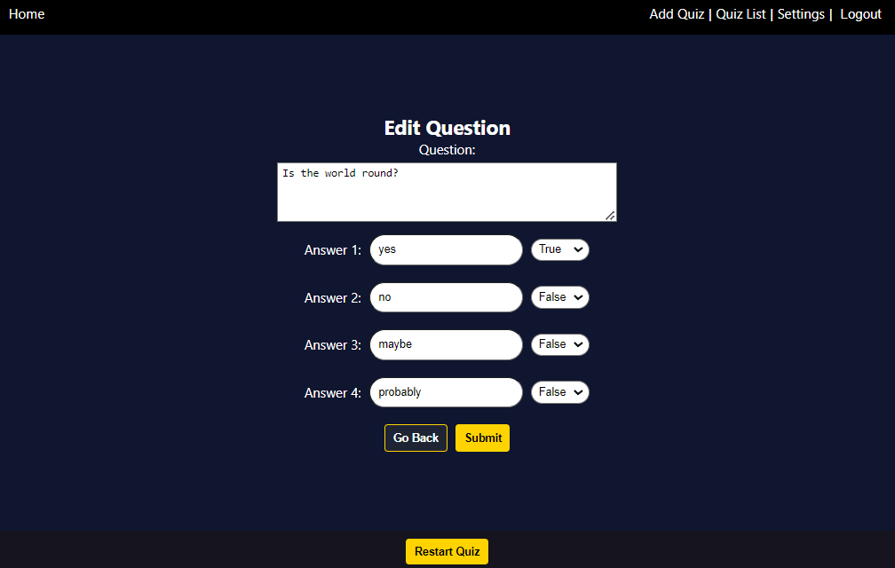
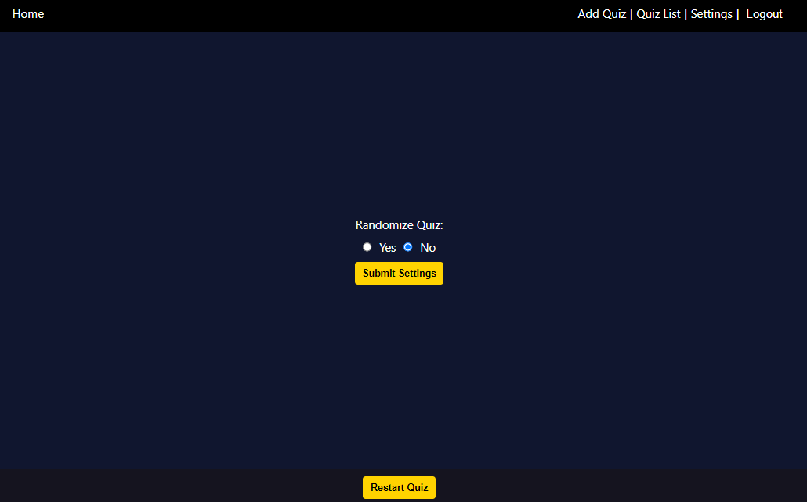
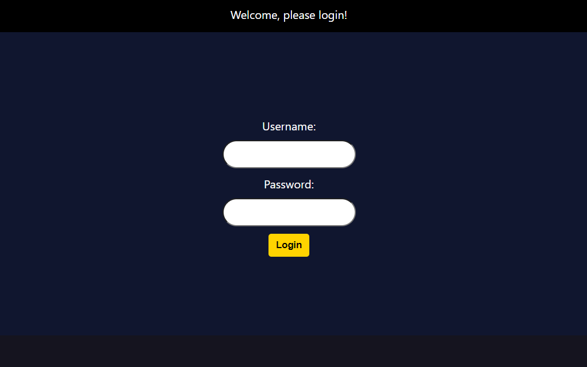

# MERN Quiz App

This is a full-stack MERN (MongoDB, Express, React, Node.js) quiz application that allows users to create, take, and manage quizzes.

## Dashboard

## Quiz

## Summary

## Edit or Delete a Question


## Settings


## Table of Contents

- [Features](#features)
- [Technologies](#technologies)
- [Getting Started](#getting-started)
  - [Prerequisites](#prerequisites)
  - [Installation](#installation)
- [Usage](#usage)
- [Contributing](#contributing)

## Features

- Create, edit, and delete quizzes.
- Take quizzes with multiple-choice questions.
- Real-time scoring and immediate feedback on quiz results.
- User-friendly and responsive design.
- Secure API endpoints for quiz management.

## Technologies

- **Frontend:**
  - React
  - React Router for routing
  - Fetch for making API requests
  - State management using Redux (including redux-persist)
  - Lazy Loading + Suspense

- **Backend:**
  - Node.js
  - Express.js
  - MongoDB for data storage
  - Nodemon
  - bcyrpt

- **Authentication:**
  - Passport.js

- **Testing:**
  - Jest

## Getting Started

### Prerequisites

Before you begin, ensure you have met the following requirements:

- **Node.js:** Make sure you have Node.js installed on your local machine. You can download it from [nodejs.org](https://nodejs.org/).

- **MongoDB:** You need to have a MongoDB instance set up. You can install MongoDB locally or use a cloud-hosted MongoDB service.

### Installation

1. Clone the repository:

   ```bash
   git clone https://github.com/MyNameIsCarsten/react-quiz.git
   ```

2. Navigate to the project directory:

   ```bash
   cd react-quiz
   ```

3. Install client dependencies:

   ```bash
   npm install
   ```

4. Navigate to the `api` (server) directory and install api dependencies:

   ```bash
   cd aou
   npm install
   ```

5. Back in the project root, create a `.env` file and configure the following environment variables:

   - `ATLAS_URI`: Your MongoDB connection string.
   - `ADMIN_ID`: Id of your admin with your MongoDB-Users collection

6. Start the development server:

   ```bash
   npm run dev
   ```

Your MERN quiz app should now be up and running.

## Usage

1. Access the app in your web browser by navigating to `http://localhost:3000`.

2. Log in to create and manage quizzes.

`Please contact me for testing credentials`



3. Users can take quizzes created by themself.

4. Enjoy the quiz-taking and creation experience!


## Contributing

Contributions are always welcome! Please feel free to submit issues, create pull requests, or reach out to the project maintainers for any questions or suggestions.

